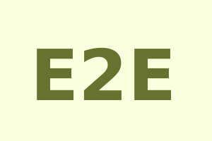

# IonicE2E

### Ionic 2 starter files with Protractor for E2E tests
This is a tabs Ionic 2 project in which you can use Protractor to run E2E tests

### Protractor Style Guide
If your are looking for guidelines for testing best practices with Protractor you should check <a src="https://github.com/CarmenPopoviciu/protractor-styleguide">Protractor Style Guide</a>

### Usage
<table>
<thead>
<th>Command</th>
<th>Explanation</th>
</thead>
<tbody>
<tr>
<td>git clone https://github.com/GeorgeAnagnostopoulos/IonicE2E.git IonicE2ETest</td><td>clone into IonicE2ETest directory</td>
</tr>
<tr><td>cd IonicE2ETest</td><td>change to project directory</td>
<tr><td>npm install </td><td>install dependencies</td>
<tr><td>npm run e2e </td><td>run basic E2E tests included</td>
</tbody>
</table>
